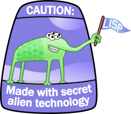

# cl-image2text

*image2text* is an image-to-text converter, written in Common Lisp.



Resulting text uses `^[[38;2;R;G;Bm` and `^[[48;2;R;G;Bm` ANSI true color codes
and Unicode block characters.

## Installation

1. Install [Roswell](https://github.com/roswell/roswell) to your system.

If you use Arch Linux, there is a package available in AUR: [roswell](https://aur.archlinux.org/packages/roswell/).

2. Install *image2text*:

```sh
$ ros install ivanp7/cl-image2text
```

## Usage

Run program with

```sh
$ ros exec image2text OPTIONS
```

If you add `$HOME/.roswell/bin` to your `$PATH`, 
you wouldn't need to call Roswell explicitly:

```sh
$ image2text OPTIONS
```

For usage help, run

```sh
$ ros exec image2text --help
```

## Advanced usage

Modify `conversion.lisp` to change the set of characters, used for convertion.
See `define-conversion` documentation for details.

## Example

Converting an image


with command

```sh
$ ros exec image2text -x 200 -y 60 example.png
```

gives the following result:


## Author

Ivan Podmazov (ivanpzv8@gmail.com)

## [License](LICENSE)

